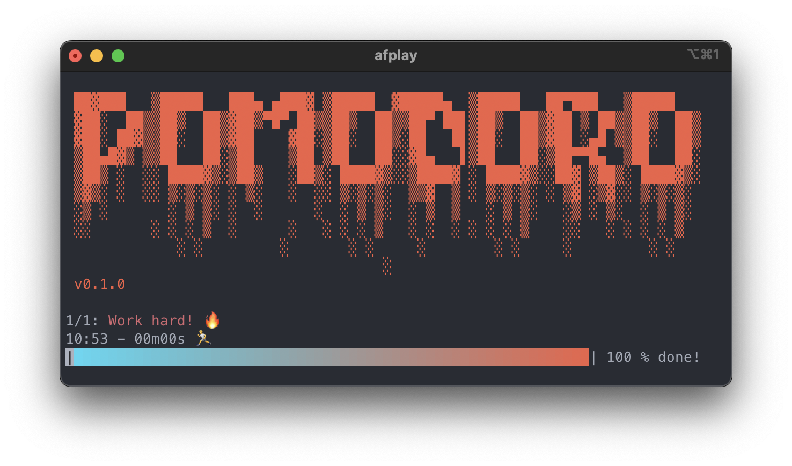

# Pypomod

A simple python CLI package for the pomodoro timer.

> Currently, only works on macOS

## Installation

```bash
pip install pypomod
```

## Use case

### How to use

```bash
# Run pomodoro timer. 20 minutes work timer, 5 minutes break timer and repeat 1 time.
pomodoro -w 20 -b 5 -r
```

### Demo



### Options

```bash
pomodoro -h

usage: pympod [-h] [-w WORK_TIME] [-b BREAK_TIME] [-r REPEAT]

A simple python CLI package for the pomodoro timer.

options:
  -h, --help            show this help message and exit
  -w WORK_TIME, --work_time WORK_TIME
                        Set the work time. Default is 20 minutes.
  -b BREAK_TIME, --break_time BREAK_TIME
                        Set the break time. Default is 5 minutes.
  -r REPEAT, --repeat REPEAT
                        Set the number of repeats. Default is 1.
```

## WIP

- [ ] Linux and Windows are not fully supported yet.
